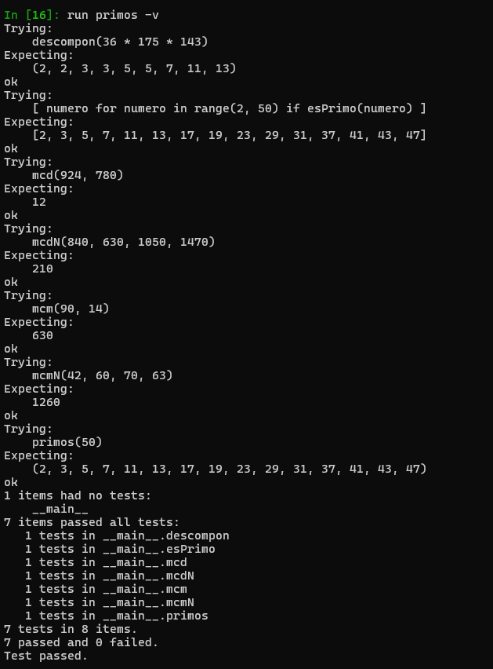

# Segunda tarea de APA 2023: Manejo de números primos

## Nom i cognoms

## Fichero `primos.py`

- El alumno debe escribir el fichero `primos.py` que incorporará distintas funciones relacionadas con el manejo
  de los números primos.

- El fichero debe incluir una cadena de documentación que incluirá el nombre del alumno y los tests unitarios
  de las funciones incluidas.

- Cada función deberá incluir su propia cadena de documentación que indicará el cometido de la función, los
  argumentos de la misma y la salida proporcionada.

- Se valorará lo pythónico de la solución; en concreto, su claridad y sencillez, y el uso de los estándares marcados
  por PEP-8. También se valorará su eficiencia computacional.

### Determinación de la *primalidad* y descomposición de un número en factores primos

Incluya en el fichero `primos.py` las tres funciones siguientes:

- `esPrimo(numero)`   Devuelve `True` si su argumento es primo, y `False` si no lo es.
- `primos(numero)`    Devuelve una **tupla** con todos los números primos menores que su argumento.
- `descompon(numero)` Devuelve una **tupla** con la descomposición en factores primos de su argumento.

### Obtención del mínimo común múltiplo y el máximo común divisor

Usando las tres funciones del apartado anterior (y cualquier otra que considere conveniente añadir), escriba otras
dos que calculen el máximo común divisor y el mínimo común múltiplo de sus argumentos:

- `mcm(numero1, numero2)`:  Devuelve el mínimo común múltiplo de sus argumentos.
- `mcd(numero1, numero2)`:  Devuelve el máximo común divisor de sus argumentos.

Estas dos funciones deben cumplir las condiciones siguientes:

- Aunque se trate de una solución sub-óptima, en ambos casos deberá partirse de la descomposición en factores
  primos de los argumentos usando las funciones del apartado anterior.

- Aunque también sea sub-óptimo desde el punto de vista de la programación, ninguna de las dos funciones puede
  depender de la otra; cada una debe programarse por separado.

### Obtención del mínimo común múltiplo y el máximo común divisor para un número arbitrario de argumentos

Escriba las funciones `mcmN()` y `mcdN()`, que calculan el mínimo común múltiplo y el máximo común divisor para un
número arbitrario de argumentos:

- `mcm(*numeros)`:  Devuelve el mínimo común múltiplo de sus argumentos.
- `mcd(*numeros)`:  Devuelve el máximo común divisor de sus argumentos.

### Tests unitarios

La cadena de documentación del fichero debe incluir los tests unitarios de las cinco funciones. En concreto, deberán
comprobarse las siguientes condiciones:

- `esPrimo(numero)`:  Al ejecutar `[ numero for numero in range(2, 50) if esPrimo(numero) ]`, la salida debe ser
                      `[2, 3, 5, 7, 11, 13, 17, 19, 23, 29, 31, 37, 41, 43, 47]`.
- `primos(numeor)`: Al ejecutar `primos(50)`, la salida debe ser `(2, 3, 5, 7, 11, 13, 17, 19, 23, 29, 31, 37, 41, 43, 47)`.
- `descompon(numero)`: Al ejecutar `descompon(36 * 175 * 143)`, la salida debe ser `(2, 2, 3, 3, 5, 5, 7, 11, 13)`.
- `mcm(num1, num2)`: Al ejecutar `mcm(90, 14)`, la salida debe ser `630`.
- `mcd(num1, num2)`: Al ejecutar `mcd(924, 780)`, la salida debe ser `12`.
- `mcmN(numeros)`: Al ejecutar `mcm(42, 60, 70, 63)`, la salida debe ser `1260`.
- `mcdN(numeros)`: Al ejecutar `mcd(840, 630, 1050, 1470)`, la salida debe ser `210`.

### Entrega

#### Ejecución de los tests unitarios

Inserte a continuación una captura de pantalla que muestre el resultado de ejecutar el fichero `primos.py` con la opción
*verbosa*, de manera que se muestre el resultado de la ejecución de los tests unitarios.



#### Código desarrollado

Inserte a continuación el contenido del fichero `primos.py` usando los comandos necesarios para que se realice el
realce sintáctico en Python del mismo.

```python
""" 
Pol Alaminos Martorell 

"""


import math


def esPrimo(num):
    """
    
    >>> esPrimo(5)
    True
    
    Devuelve True si su argumento es primo y False si no lo es
    >>> [ numero for numero in range(2, 50) if esPrimo(numero) ]
    [2, 3, 5, 7, 11, 13, 17, 19, 23, 29, 31, 37, 41, 43, 47]
    
    >>> esPrimo(1023)
    False
    
    >>> esPrimo(1021)
    True
    
    """
    
    for it in range(2, num):
        if num % it == 0: 
            return False      
    return True

def primos(lim):
    """
    Devuelve una lista con los números primos menores que el argumento
    >>> primos(50)
    (2, 3, 5, 7, 11, 13, 17, 19, 23, 29, 31, 37, 41, 43, 47)
    """

    return tuple(i for i in range(2, lim) if esPrimo(i))

def descompon(num):
    """
    Devuelve una tupla con la descomposición en números primos del argumento ordenada de menor a mayor.
    En este caso utilizamos la Propiedad de los números primos donde:
    si un número compuesto n tiene un divisor d, d <= sqrt(n)
    
    >>> descompon(36 * 175 * 143)
    (2, 2, 3, 3, 5, 5, 7, 11, 13)
    """

    desc = []
    divisor = 2
    while divisor **2 <= num:     #Si d**2 > n ya no existen más divisores por lo tanto termina el bucle.
        if num % divisor == 0:    #Si la división es exacta forma parte de la descomposición.
            desc.append(divisor)
            num //= divisor       #Dividimos el número por el divisor como en la descomposición.
        else:
            divisor += 1          #Si la division no es exacta aumentamos divisor hasta sqrt(num) como máximo.
    if num > 1:
        desc.append(num)      #Si el último valor de num es mayor que 1, significa que es un primo divisor.
    return tuple(desc) 
    
def mcm(num1, num2):
    """
    Devuelve el mínimo común múltiplo de los dos argumentos
    >>> mcm(90, 14)
    630
    """
    desc1 = descompon(num1)
    desc2 = descompon(num2)
    mcmList = list(desc1)                       #Añadimos todos los múltimplos del num1 a la lista.
    for i in range(len(desc2)):                 #Recorremos los múltiplos del num2.
        quantDesc1 = mcmList.count(desc2[i])
        quantDesc2 = desc2.count(desc2[i])
        if quantDesc1 < quantDesc2:             #Comprueba si los múltiplos están ya en la lista y si lo estan, nos aseguramos
            n = quantDesc2 - quantDesc1         #que coja la máxima cantidad de múltiplos.
            for j in range(n):
                mcmList.append(desc2[i])
    return math.prod(mcmList)                   #Devuelve el producto de todos los múltiplos (mcm).

def mcd(num1, num2):
    """
    Devuelve el máximo común divisor de los dos argumentos
    >>> mcd(924, 780)
    12
    """
    desc1 = descompon(num1)
    desc2 = descompon(num2)
    list2 = list(desc2)
    mcdList = []
    for i in range(len(desc1)):
        if desc1[i] in list2:
            mcdList.append(desc1[i])
            list2.remove(desc1[i])
    return math.prod(mcdList)                    #Devuelve el producto de todos los múltiplos (mcd).

def mcmN(*nums):
    """Devuelve el mínimo común múltiplo de todos los argumentos
    >>> mcmN(42, 60, 70, 63)
    1260
    """
    
    MCM = 1
    for i in range(len(nums)):
        MCM = mcm(MCM, nums[i])
    return MCM

def mcdN(*nums):
    """
    Devuelve el máximo común divisor de todos los argumentos
    >>> mcdN(840, 630, 1050, 1470)
    210
    """
    
    MCD = nums[0]
    for num in nums[1: ]:
        MCD = mcd(MCD, num)
    return MCD

if __name__ == "__main__":
    import doctest
    doctest.testmod()
```

#### Subida del resultado al repositorio GitHub ¿y *pull-request*?

El fichero `primos.py`, la imagen con la ejecución de los tests unitarios y este mismo fichero, `README.md`, deberán
subirse al repositorio GitHub mediante la orden `git push`. Si los profesores de la asignatura consiguen montar el
sistema a tiempo, la entrega se formalizará realizando un *pull-request* al propietario del repositorio original.

El fichero `README.md` deberá respetar las reglas de los ficheros Markdown y visualizarse correctamente en el repositorio,
incluyendo la imagen con la ejecución de los tests unitarios y el realce sintáctico del código fuente insertado.
